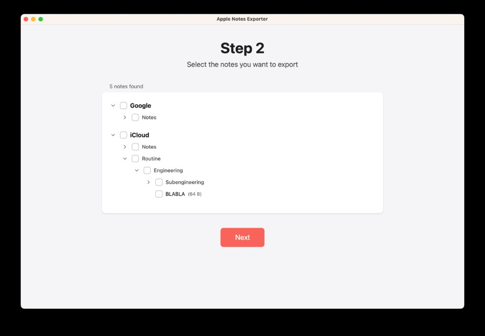

# Apple Notes Exporter

Export your Apple Notes to HTML, Markdown, or PDF — preserving folder hierarchy, formatting, and structure.



## System Requirements

- **macOS** (required — Apple Notes is only available on macOS)
- **Node.js** v18 or later
- **npm** v9 or later
- **Apple Notes** with at least one account configured
- **Automation permissions**: macOS will prompt you to grant the app permission to control Apple Notes on first run. You must allow this for the export to work.

## Getting Started

### Install dependencies

```sh
brew install node
```

### Build and run from source

```sh
git clone https://github.com/routineco/apple-notes-exporter.git
cd apple-notes-exporter
npm install
npm start
```

This launches the Electron app, which will guide you through the export process.

### Run scripts directly

You can also run the core AppleScript independently:

```sh
osascript scripts/list.applescript
```

## How It Works

The application follows a two-phase approach to work around AppleScript's slow performance (listing 10,000 notes can take ~20 hours):

1. **Scan & export** — Browse the full note hierarchy and export all notes as HTML to the app data directory in a single pass.
2. **Select & convert** — Pick the notes you want, choose an output format (HTML, Markdown, or PDF), and export them to a directory of your choice.

## Export Formats

| Format   | Description                              |
|----------|------------------------------------------|
| HTML     | Original note content as-is              |
| Markdown | Converted from HTML via `node-html-markdown` |
| PDF      | Converted from HTML via `jspdf`          |

## Background

Apple Notes content is not directly accessible in a structured form. While the Notes app offers a `body()` method through scripting interfaces, it only exposes simplified HTML. Many important semantics — such as hyperlinks and checklists — are not included in the HTML or RTF generated by standard means.

We explored multiple approaches to extract note content with full semantic fidelity:

### 1. SQLite

Direct extraction from Apple Notes' SQLite database. Unreliable after Apple transitioned to iCloud, as data is scattered across multiple databases.

### 2. JXA (JavaScript for Automation)

Accessing notes via `note.body()` returns simplified HTML, but `<li>` tags provide no distinction between bullet, numbered, and checklist items. Hyperlinks and checkbox state are omitted.

### 3. JXA to RTF (via `textutil`)

Converting HTML to RTF via `textutil` retrieves slightly richer content from macOS internals, but hyperlinks are still flattened and checklists become generic glyphs.

### 4. Swift App (via `NSAttributedString`)

A native Swift app using `ScriptingBridge` to extract `NSAttributedString` representations. Even at this level, Apple Notes does not expose `.link` attributes or `.presentationIntents` for checklists.

### 5. AppleScript (chosen approach)

AppleScript provides the most reliable and automatable method for exporting. It accesses all visible notes, folders, and accounts, producing consistent HTML output — though it still cannot detect hyperlinks or checklist state.

## License

[MIT](LICENSE)
